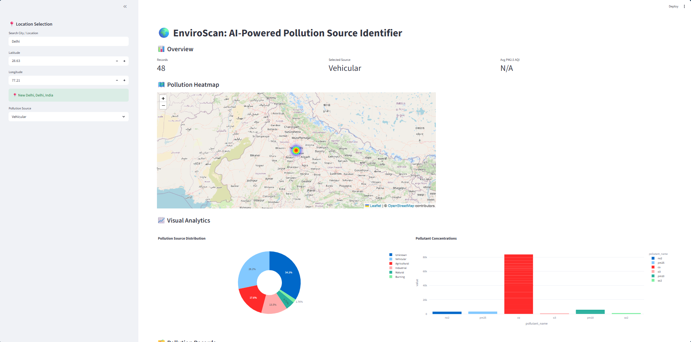
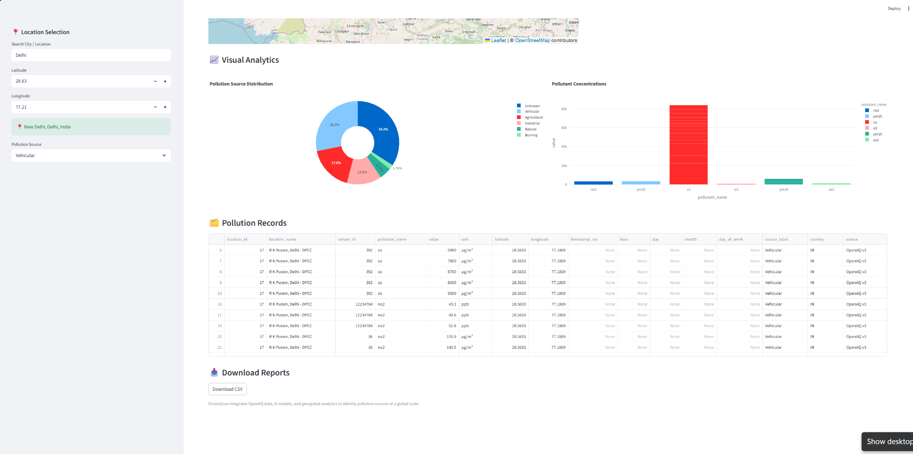

# 🌍 **EnviroScan: AI-Powered Pollution Source Identifier using Geospatial Analytics**

**Submitted by:**
Shreya N Gowda  
Department of Computer Science and Engineering  
Jain Institute of Technology, Davanagere


---

## **Abstract**

Air pollution poses a serious threat to public health and the environment. Traditional air-quality monitoring systems primarily report pollutant concentrations but fail to identify the underlying pollution sources.
EnviroScan is an AI-powered system designed to collect real-time air-quality data, preprocess and analyze it using machine learning, and identify likely pollution sources such as vehicular, industrial, agricultural, burning, or natural. The system integrates live API data, geospatial analytics, and an interactive dashboard to provide meaningful insights for environmental monitoring and decision-making.

---

## **1. Introduction**

Rapid urbanization and industrialization have significantly increased air pollution levels in many cities. While air-quality monitoring stations provide pollutant readings, interpreting these values and identifying pollution sources remains a challenge.
EnviroScan aims to bridge this gap by combining machine learning and geospatial analysis to automatically classify pollution sources and visualize them through an interactive dashboard.

---

## **2. Problem Statement**

* Existing air-quality systems only report pollutant concentrations
* Pollution source identification is largely manual
* Lack of real-time visual analytics
* Limited decision-support tools for policymakers

**Problem:**
To design an automated system that identifies pollution sources from air-quality data and presents insights through an interactive dashboard.

---

## **3. Data Sources**

### **3.1 OpenAQ Public Air-Quality API**

* Live air-quality data collected using **OpenAQ API v3**
* Pollutants collected:

  * PM2.5
  * PM10
  * NO₂
  * SO₂
  * CO
  * O₃
* Data collected from multiple Indian cities

### **3.2 OpenStreetMap (OSM)**

* Used for geospatial features such as:

  * Road networks
  * Industrial areas
  * Agricultural land
* Enables proximity-based feature extraction

### **3.3 Derived Temporal Features**

* Hour of the day
* Day of the month
* Month
* Day of the week

These features help capture temporal pollution patterns.

---

## **4. Data Preprocessing and Cleaning**

* Removal of duplicate records
* Handling missing values
* Conversion of data types
* Validation of latitude and longitude ranges
* Filtering invalid pollutant values

Cleaned data ensures reliability for model training and analysis.

---

## **5. Machine Learning Models**

The following models were considered:

* Decision Tree
* Random Forest Classifier

**Final Model Selected:**

* **Random Forest Classifier**
  Chosen due to its robustness, ability to handle non-linear relationships, and high accuracy.

---

## **6. Model Architecture and Training**

### **6.1 Stratified Train–Test Split**

* Dataset split into:

  * 80% Training data
  * 20% Testing data
* Stratification ensures balanced class distribution

### **6.2 Class Re-Balancing**

* Addressed class imbalance by:

  * Using heuristic labeling
  * Ensuring minority class representation

### **6.3 Random Forest Configuration**

* Multiple decision trees
* Gini impurity criterion
* Ensemble-based voting for predictions

---

## **7. Hyperparameter Tuning**

* Number of trees (n_estimators)
* Maximum tree depth
* Minimum samples per leaf

Tuning was performed to improve generalization and avoid overfitting.

---

## **8. Model Evaluation**

### **8.1 Metrics Used**

* Accuracy
* Precision
* Recall
* F1-Score
* Confusion Matrix

**Final Accuracy Achieved:** **91%**

---

## **9. Geospatial Visualization and Mapping**

* Folium used for interactive heatmaps
* Pollution intensity visualized spatially
* Source-wise filtering supported
* Helps identify high-risk zones

---

## **10. System Architecture**

```
OpenAQ API
     ↓
Data Collection
     ↓
Preprocessing
     ↓
Feature Engineering
     ↓
Machine Learning Model
     ↓
Source Prediction
     ↓
Streamlit Dashboard
```

---

## **11. Technology Stack**

| Component     | Technology     |
| ------------- | -------------- |
| Language      | Python 3.10    |
| Data Source   | OpenAQ API v3  |
| ML Library    | Scikit-learn   |
| Dashboard     | Streamlit      |
| Visualization | Folium, Plotly |
| Geocoding     | Geopy          |
| Model Storage | Joblib         |

---

 ##**12. Future Scope**

* Integration with weather APIs
* Advanced models (XGBoost, Deep Learning)
* Real-time alert notifications
* Global pollution monitoring
* Mobile-friendly dashboard

---

## **13. Conclusion**

EnviroScan successfully demonstrates how AI and geospatial analytics can be used to identify pollution sources and visualize air-quality data interactively. The system achieved high accuracy and provides a scalable framework for environmental monitoring and decision support.

---

## **14. Dashboard**

* Developed using Streamlit
 Features:

  * Location search
  * Pollution heatmap
  * Interactive charts
  * AQI alerts
  * Data download options
## 📸 Dashboard Screenshots

### Pollution Heatmap


### Analytics Charts



---

## **15. References**

1. OpenAQ Platform – (https://openaq.org)
2. Scikit-learn Documentation – (https://scikit-learn.org)
3. Streamlit Documentation – (https://streamlit.io)
4. OpenStreetMap – (https://www.openstreetmap.org)


