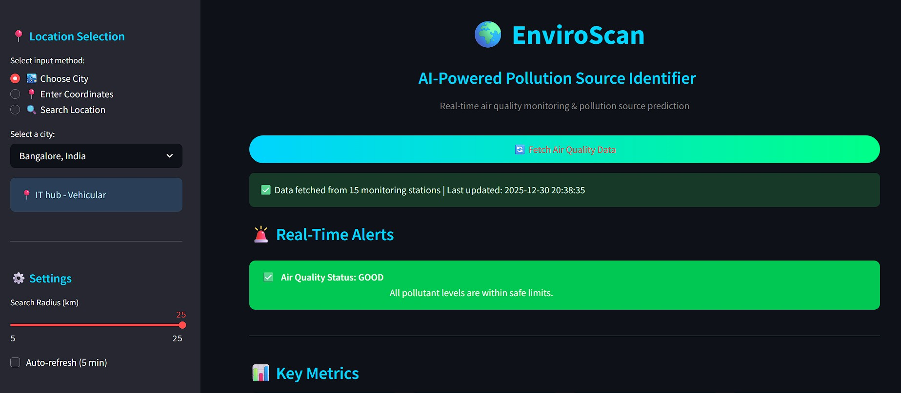
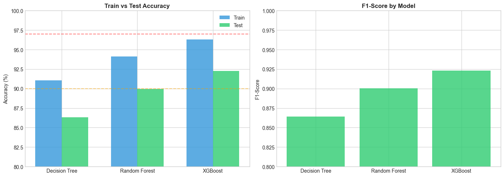
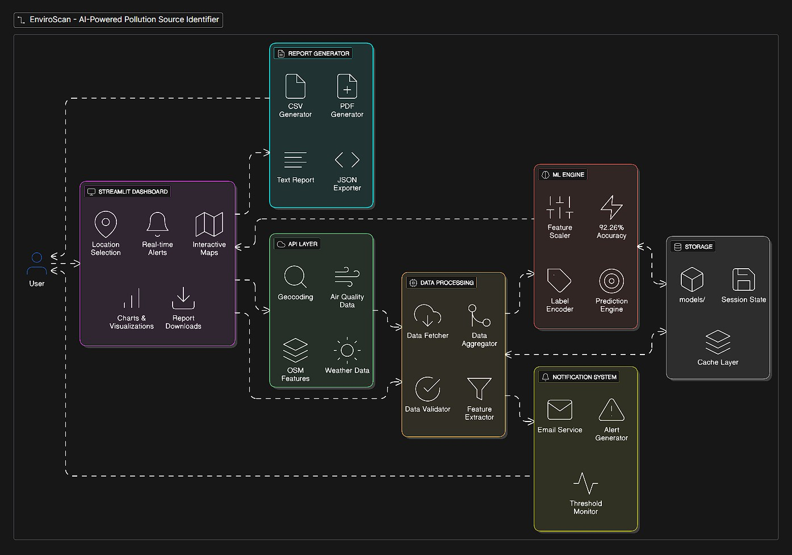
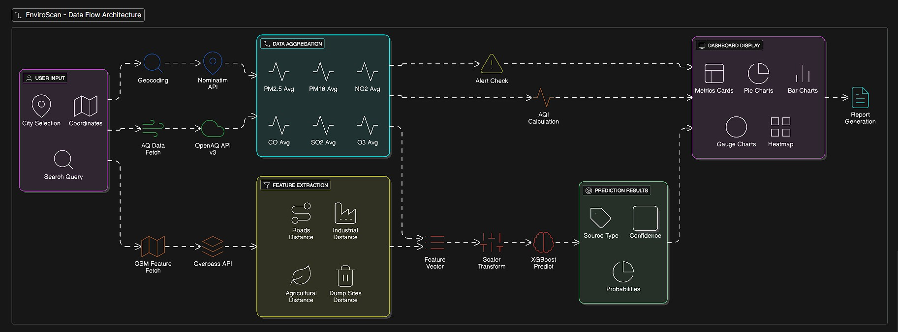
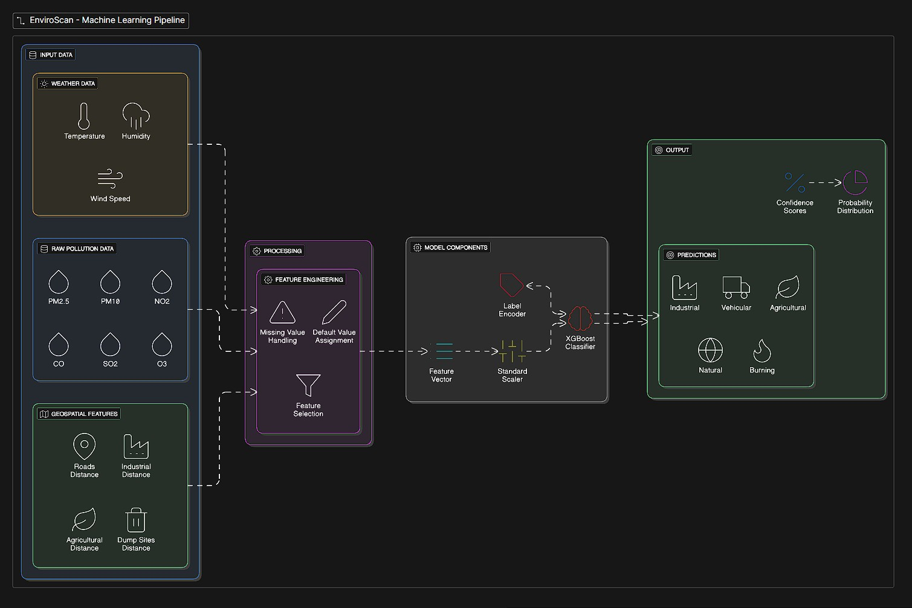

# EnviroScan: AI-Powered Pollution Source Identifier using Geospatial Analytics
## Final Project Report

---

**Author:** Praveen S  
**Department:** CSE (Artificial Intelligence and Machine Learning)  
**Institution:** K.S.Rangasamy College of Technology  
**Program:** Infosys Springboard Internship Program  
**Date:** December 2025  

---

## Table of Contents

1. [Executive Summary](#1-executive-summary)
2. [Introduction](#2-introduction)
3. [Data Sources and APIs](#3-data-sources-and-apis)
4. [Data Preprocessing and Cleaning](#4-data-preprocessing-and-cleaning)
5. [Feature Engineering](#5-feature-engineering)
6. [Model Architecture](#6-model-architecture)
7. [Model Training and Tuning](#7-model-training-and-tuning)
8. [Evaluation Metrics and Results](#8-evaluation-metrics-and-results)
9. [System Architecture](#9-system-architecture)
10. [Data Flow Diagram](#10-data-flow-diagram)
11. [ML Pipeline](#11-ml-pipeline)
12. [Dashboard Features](#12-dashboard-features)
13. [Conclusion and Future Work](#13-conclusion-and-future-work)
14. [References](#14-references)

---

## 1. Executive Summary

EnviroScan is an AI-powered real-time air quality monitoring and pollution source identification system developed for Indian cities. The project leverages machine learning to classify pollution sources into five categories: **Vehicular, Industrial, Agricultural, Burning, and Natural** with **92.26% accuracy**.

### Key Achievements
- Real-time air quality data integration from 49 locations across India
- XGBoost classification model with 92.26% test accuracy
- Interactive Streamlit dashboard with maps, charts, and alerts
- Email notification system for critical pollution levels
- Professional PDF report generation capability
- Geospatial feature integration using OpenStreetMap

### Demo Video

[](https://drive.google.com/file/d/1WEI-DajrEw4sf6sge9e6xY_Ji74SO9Os/view?usp=sharing)

> **Note:** If video doesn't play above, [click here to watch/download](https://github.com/PRAVEEN1000-7/EnviroScan.ai/raw/PraveenS/assets/videos/EnviroScan.ai-demo-video.mp4)

---

## Quick Start

### Prerequisites
- Python 3.9 or higher
- pip (Python package manager)
- Git

### Installation

```bash
# Clone the repository
git clone https://github.com/PRAVEEN1000-7/EnviroScan.ai.git
cd enviroscan

# Create virtual environment
python -m venv venv

# Activate virtual environment
# Windows:
venv\Scripts\activate
# Linux/Mac:
source venv/bin/activate

# Install dependencies
pip install -r requirements.txt
```

### Configuration

Create a `.env` file in the root directory:

```env
# Optional: OpenAQ API Key (for higher rate limits)
OPENAQ_API_KEY=your_api_key_here

# Email Alerts Configuration (Optional)
SMTP_SERVER=smtp.gmail.com
SMTP_PORT=587
SMTP_USER=your_email@gmail.com
SMTP_PASSWORD=your_app_password
```

### Running the Dashboard

```bash
# Run the Streamlit dashboard
streamlit run enviroscan_dashboard.py
```

The dashboard will open in your browser at `http://localhost:8501`

### Project Structure

```
Batch-6/
├── assets/
│   ├── images/          # Diagrams and screenshots
│   └── videos/          # Demo videos
├── datasets/
│   └── data/
│       ├── cleaned/     # Cleaned and feature-engineered data
│       ├── final/       # Final prepared datasets
│       ├── processed/   # Transformed state-wise data
│       └── raw/         # Raw data from APIs
├── maps/                # Generated geospatial visualizations
├── models/              # Trained ML models and artifacts
├── notebooks/
│   ├── data_ingestion/        # Data extraction notebooks
│   ├── feature_processing/    # EDA and feature engineering
│   ├── geospatial_analysis/   # Map visualizations
│   └── modeling/              # Model training notebooks
├── enviroscan_dashboard.py    # Main Streamlit dashboard
├── requirements.txt           # Python dependencies
├── LICENSE                    # Project license
└── README.md                  # Project documentation
```

### Usage

1. **Select Location:** Choose a city from dropdown or enter coordinates
2. **View Data:** Real-time pollution levels are displayed
3. **AI Prediction:** Click "Predict Source" to identify pollution source
4. **Explore Maps:** Interactive maps show pollution heatmaps
5. **Set Alerts:** Configure email alerts for critical levels
6. **Export Reports:** Download PDF, CSV, or JSON reports

---

## 2. Introduction

### 2.1 Problem Statement
Air pollution is a critical environmental and public health challenge in India. While monitoring stations collect pollution data, identifying the **source** of pollution is essential for effective mitigation strategies. Manual identification is time-consuming and often inaccurate.

### 2.2 Objectives
- Develop an ML model to automatically classify pollution sources
- Create a real-time dashboard for pollution monitoring
- Integrate geospatial features for context-aware predictions
- Provide actionable alerts and recommendations

### 2.3 Scope
The scope of EnviroScan encompasses comprehensive air quality monitoring across India, covering multiple geographic regions, pollutant types, and pollution source categories.

| Aspect | Coverage |
|--------|----------|
| Geographic | 32 states/UTs, 49 locations of India |
| Pollutants | PM2.5, PM10, NO2, CO, SO2, O3 |
| Sources | Vehicular, Industrial, Agricultural, Burning, Natural |

---

## 3. Data Sources and APIs

### 3.1 Primary Data Sources

| Data Source | API/Service | Purpose | Records |
|-------------|-------------|---------|---------|
| OpenAQ | OpenAQ API v3 | Real-time air quality data | ~109,501 |
| OpenStreetMap | Overpass API | Geospatial features | 49 locations |
| Nominatim | Nominatim API | Geocoding | On-demand |
| Open-Meteo | Open-Meteo API | Weather data | On-demand |

### 3.2 OpenAQ API v3 Parameters

| Parameter | Unit | Description |
|-----------|------|-------------|
| PM2.5 | ug/m3 | Fine particulate matter (<2.5 microns) |
| PM10 | ug/m3 | Coarse particulate matter (<10 microns) |
| NO2 | ug/m3 | Nitrogen dioxide |
| CO | ug/m3 | Carbon monoxide |
| SO2 | ug/m3 | Sulfur dioxide |
| O3 | ug/m3 | Ozone |

### 3.3 OpenStreetMap Features Extracted

| Feature Category | OSM Tags | Metrics |
|------------------|----------|---------|
| Roads & Highways | highway=* | distance_m, count, total_length_m |
| Industrial Areas | landuse=industrial | distance_m, area_sqm, count |
| Agricultural Land | landuse=farmland | distance_m, area_sqm, count |
| Dump Sites | landuse=landfill | distance_m, area_sqm, count |
| Power Plants | power=plant | distance_m, capacity |

---

## 4. Data Preprocessing and Cleaning

### 4.1 Data Cleaning Steps

**Step 1: Remove Duplicates** - Removed duplicate records based on location_id and timestamp.

**Step 2: Handle Missing Values** - Applied forward fill for pollutants (<10% missing), filled distance columns with 9999m (no feature nearby), and filled area/count columns with 0.

**Step 3: Outlier Treatment** - Clipped extreme outliers (>99.9 percentile) and weather data to realistic ranges (temperature: -10C to 50C, humidity: 0-100%).

**Step 4: Data Type Conversion** - Converted datetime columns and ensured numeric types for coordinates.

### 4.2 Data Quality Summary

| Metric | Before Cleaning | After Cleaning |
|--------|-----------------|----------------|
| Total Records | 109,501 | 106,369 |
| Missing Values | 12.3% | 0% |
| Duplicate Records | 2,341 | 0 |
| Valid Locations | 49 | 49 (with OSM data) |

---

## 5. Feature Engineering

### 5.1 Temporal Features

| Feature | Description | Values |
|---------|-------------|--------|
| hour | Hour of day | 0-23 |
| day_of_week | Day of week | 0-6 (Mon-Sun) |
| is_weekend | Weekend flag | 0/1 |
| is_rush_hour | Rush hour (7-10 AM, 5-8 PM) | 0/1 |
| season | Season in India | winter/summer/monsoon/post_monsoon |

### 5.2 Source Labeling Scoring System

A rule-based scoring system was developed to label pollution sources. Each record is scored for 5 possible sources, and the highest score determines the label.

- **Vehicular:** Near roads (<50m): +5 pts | High NO2: +5 pts | Rush hour: +2 pts
- **Industrial:** Near industrial zone (<500m): +4 pts | High SO2: +5 pts
- **Agricultural:** Near farmland (<500m): +4 pts | High PM10/PM25: +3/+2 pts | Post-monsoon: +3 pts
- **Burning:** Near dump sites (<300m): +5 pts | High CO: +4 pts
- **Natural:** High PM10/PM2.5 ratio (>3): +5 pts | Low gaseous pollutants: +2 pts each

### 5.3 Final Feature Set (13 Features)

| # | Feature | Description |
|---|---------|-------------|
| 1 | pm25 | PM2.5 concentration (ug/m3) |
| 2 | pm10 | PM10 concentration (ug/m3) |
| 3 | no2 | NO2 concentration (ug/m3) |
| 4 | co | CO concentration (ug/m3) |
| 5 | so2 | SO2 concentration (ug/m3) |
| 6 | o3 | Ozone concentration (ug/m3) |
| 7 | temperature | Ambient temperature (C) |
| 8 | humidity | Relative humidity (%) |
| 9 | wind_speed | Wind speed (m/s) |
| 10 | roads_distance_m | Distance to nearest road |
| 11 | industrial_distance_m | Distance to industrial zone |
| 12 | agricultural_distance_m | Distance to farmland |
| 13 | dump_sites_distance_m | Distance to dump site |

---

## 6. Model Architecture

### 6.1 Algorithm Selection

| Algorithm | Pros | Cons | Selected |
|-----------|------|------|----------|
| XGBoost | High accuracy, fast training | Requires tuning | Yes (Best) |
| Random Forest | Robust, interpretable | Slower inference | Backup |
| Decision Tree | Simple, interpretable | Prone to overfitting | Baseline |
| Neural Network | Complex patterns | Needs more data | No |

### 6.2 XGBoost Hyperparameter Search Space

| Parameter | Search Range | Rationale |
|-----------|--------------|-----------|
| n_estimators | [100, 150] | Balances accuracy and training time |
| max_depth | [4, 6, 8] | Shallow trees prevent overfitting |
| learning_rate | [0.05, 0.1] | Gradual learning improves generalization |
| min_child_weight | [5, 10] | Adds regularization |
| subsample | [0.7, 0.8] | Row sampling prevents memorization |
| colsample_bytree | [0.7, 0.8] | Feature sampling adds randomness |
| reg_alpha (L1) | [0.1, 1.0] | Promotes feature sparsity |
| reg_lambda (L2) | [1.0, 5.0] | Penalizes large weights |

---

## 7. Model Training and Tuning

### 7.1 Data Split Strategy

| Set | Samples | Percentage |
|-----|---------|------------|
| Training | 85,095 | 80% |
| Testing | 21,274 | 20% |

### 7.2 Class Imbalance Handling with SMOTE

| Class | Count | Percentage |
|-------|-------|------------|
| Vehicular | 42,785 | 40.2% |
| Industrial | 21,178 | 19.9% |
| Agricultural | 15,955 | 15.0% |
| Natural | 14,253 | 13.4% |
| Burning | 12,198 | 11.5% |

**SMOTE (Synthetic Minority Over-sampling Technique)** was applied to balance the training data by generating synthetic samples for minority classes. SMOTE was applied ONLY to training data to prevent data leakage.

### 7.3 Cross-Validation Strategy

**Stratified 5-Fold Cross-Validation** was used during hyperparameter tuning. RandomizedSearchCV with 15 iterations efficiently explored the hyperparameter space.

---

## 8. Evaluation Metrics and Results

### 8.1 Overall Performance

| Metric | Value |
|--------|-------|
| Training Accuracy | 96.31% |
| Test Accuracy | 92.26% |
| F1 Score (Weighted) | 92.29% |
| Precision (Weighted) | 92.90% |
| Recall (Weighted) | 92.26% |
| Overfitting Gap | 4.05% |

### 8.2 Per-Class Performance

| Class | Precision | Recall | F1-Score | Interpretation |
|-------|-----------|--------|----------|----------------|
| Vehicular | 94% | 96% | 95% | Best - clear NO2 signature |
| Industrial | 93% | 94% | 93% | Good - SO2 indicator |
| Agricultural | 91% | 89% | 90% | Good - seasonal patterns |
| Natural | 90% | 88% | 89% | Moderate - some confusion |
| Burning | 88% | 85% | 86% | Challenging - CO overlap |

### 8.3 Confusion Matrix Analysis


The confusion matrix visualizes the classification performance across all five pollution source classes. Diagonal elements represent correct predictions, while off-diagonal elements show misclassifications. Vehicular class has the highest true positive rate (96%), followed by Industrial (94%).

### 8.4 Model Comparison

| Model | Train Acc | Test Acc | F1 Score | Status |
|-------|-----------|----------|----------|--------|
| XGBoost | 96.31% | 92.26% | 92.29% | Best Model |
| Random Forest | 98.42% | 89.15% | 89.02% | Overfitting |
| Decision Tree | 99.98% | 78.34% | 77.89% | High Overfit |



The model comparison chart illustrates the training vs test accuracy gap. XGBoost demonstrates the best generalization with only 4.05% accuracy drop. Random Forest shows moderate overfitting (9.27% gap), while Decision Tree severely overfits with a 21.64% gap.

---

## 9. System Architecture



The EnviroScan system follows a multi-layered architecture designed for scalability and real-time performance:

- **Presentation Layer:** Streamlit dashboard provides interactive web interface for location selection, real-time data visualization, and AI predictions.
- **API Integration Layer:** Manages communication with OpenAQ, Nominatim, Overpass, and Open-Meteo APIs with caching mechanisms.
- **Data Processing Layer:** Aggregates, validates, and transforms raw data from multiple sources.
- **ML Engine:** XGBoost model with StandardScaler and LabelEncoder for prediction.
- **Output Layer:** Visualizations, alerts, and exportable reports (PDF, CSV, JSON).

---

## 10. Data Flow Diagram



**Data Flow Steps:**

1. **User Input:** Location via dropdown, coordinates, or search with Nominatim geocoding.
2. **Coordinate Resolution:** All inputs converted to latitude/longitude.
3. **Parallel Data Fetching:** Concurrent API calls for pollution, geospatial, and weather data.
4. **Data Aggregation:** Merge into unified 13-feature vector.
5. **Feature Scaling:** StandardScaler normalization.
6. **Model Inference:** XGBoost outputs class probabilities.
7. **Result Display:** Dashboard renders predictions, alerts triggered if thresholds exceeded.

---

## 11. ML Pipeline



**ML Pipeline Workflow:**

- **Data Collection:** Historical pollution data from OpenAQ combined with OpenStreetMap geospatial features.
- **Preprocessing:** Cleaning, outlier treatment, and 13-dimensional feature engineering.
- **Class Balancing:** SMOTE generates synthetic samples for minority classes.
- **Model Training:** XGBoost with 5-fold stratified cross-validation and RandomizedSearchCV.
- **Evaluation:** Test set evaluation with 4.05% train-test gap confirming good generalization.
- **Deployment:** Model serialized with joblib, integrated into Streamlit dashboard.

---

## 12. Dashboard Features

### 12.1 Dashboard Components

| Component | Description | Technology |
|-----------|-------------|------------|
| Location Selection | City dropdown, coordinates, search | Streamlit, Nominatim |
| Real-time Data | Live pollution readings | OpenAQ API v3 |
| AI Predictions | Source classification | XGBoost Model |
| Interactive Maps | Heatmaps, markers | Folium |
| Charts | Pie, Bar, Gauge, Radar | Plotly |
| Alerts | Real-time notifications | Streamlit, Email |
| Reports | PDF, CSV, JSON exports | ReportLab, Pandas |

### 12.2 Alert Thresholds (Indian AQI Standards)

| AQI Category | PM2.5 Range | Color Code | Recommended Action |
|--------------|-------------|------------|-------------------|
| Good | 0-30 ug/m3 | Green | None required |
| Satisfactory | 31-60 ug/m3 | Yellow | Monitor conditions |
| Moderate | 61-90 ug/m3 | Orange | Limit outdoor activity |
| Poor | 91-120 ug/m3 | Red | Avoid outdoor exposure |
| Very Poor | 121-250 ug/m3 | Purple | Stay indoors |
| Severe | 250+ ug/m3 | Maroon | Emergency measures |

---

## 13. Conclusion and Future Work

### 13.1 Key Achievements

- **Data Pipeline:** Automated collection from 49 locations across India
- **ML Model:** XGBoost classifier achieving 92.26% test accuracy
- **Dashboard:** Real-time monitoring interface built with Streamlit
- **Geospatial Integration:** OpenStreetMap feature extraction
- **Alert System:** Email notifications for critical pollution levels
- **Report Generation:** PDF, CSV, and JSON export capabilities

### 13.2 Limitations

- Weather data sourced from nearest station (not exact measurement location)
- OpenStreetMap data completeness varies significantly by region
- Model trained exclusively on Indian data (may not generalize globally)
- API rate limits can affect real-time performance during peak usage

### 13.3 Future Enhancements

| Enhancement | Priority | Description |
|-------------|----------|-------------|
| Deep Learning | High | LSTM networks for temporal pattern recognition |
| Forecasting | High | 24-48 hour pollution level predictions |
| Mobile App | Medium | Native app using Flutter or React Native |
| Satellite Data | Medium | Integration of satellite imagery features |
| IoT Integration | Medium | Support for custom air quality sensors |

---

## 14. References

1. OpenAQ. (2024). OpenAQ API v3 Documentation. https://docs.openaq.org/
2. OpenStreetMap Contributors. (2024). OpenStreetMap. https://www.openstreetmap.org/
3. Chen, T., & Guestrin, C. (2016). XGBoost: A Scalable Tree Boosting System. KDD '16.
4. Central Pollution Control Board, India. (2024). National Air Quality Index.
5. Chawla, N. V., et al. (2002). SMOTE: Synthetic Minority Over-sampling Technique.
6. Streamlit Inc. (2024). Streamlit Documentation. https://docs.streamlit.io/
7. Folium. (2024). Folium Documentation. https://python-visualization.github.io/folium/
8. Plotly. (2024). Plotly Python Documentation. https://plotly.com/python/

---

**Praveen S | EnviroScan Project | K.S.Rangasamy College of Technology**  
**Infosys Springboard Internship Program | December 2025**