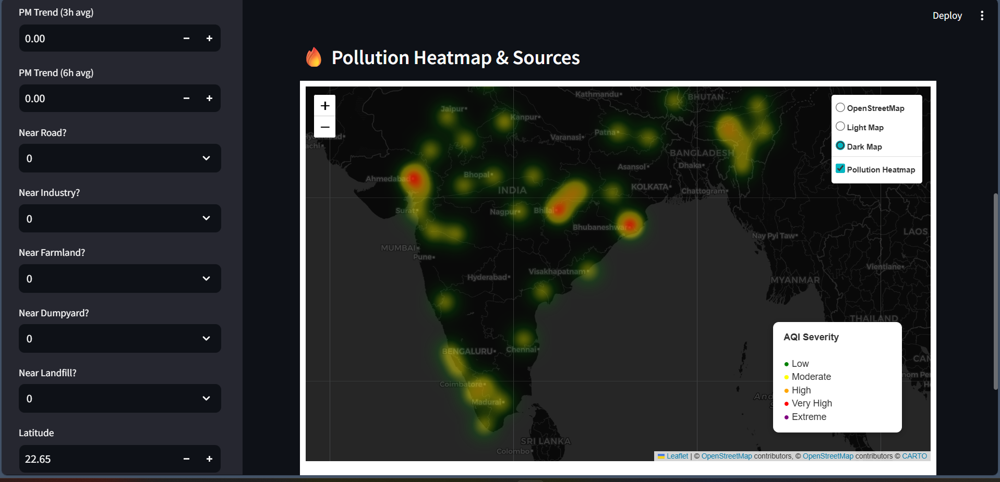
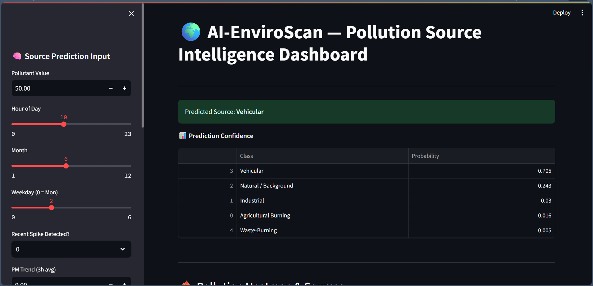

# 🌍 EnviroScan: AI‑Powered Pollution Source Identifier using Geospatial Analytics

**Submitted by**  
**Aditi Rudrakshi**  
Bachelor of Engineering (B.E.)  
Basaveshwar Engineering College

---
## Abstract
EnviroScan is an AI‑powered pollution source identification system that integrates machine learning with
geospatial analytics to classify pollution origins such as **Industrial, Vehicular, and Natural** sources.
By combining **air‑quality indicators, meteorological parameters, and spatial proximity features**, the
system delivers realistic and reliable source classification.

A **Random Forest model** was selected for deployment due to its robustness and generalization capability.
Interactive dashboards and **Folium‑based geospatial heatmaps** visualize pollution severity and
high‑risk zones, supporting data‑driven environmental monitoring and decision‑making.

---

## 1. Introduction
Air pollution is a critical challenge impacting public health, climate, and sustainability. Identifying whether
pollution arises from **vehicular emissions, industrial activity, agricultural burning, or natural background**
is essential for targeted mitigation.

EnviroScan predicts likely pollution sources using:
1. Air‑quality readings  
2. Temporal behavior patterns  
3. OpenStreetMap‑based spatial proximity  
4. Geospatial heatmaps and visualization  

The system focuses on **practical accuracy and interpretability**, supported by a **balanced Random Forest
model** designed for consistent performance across imbalanced classes.

---

## 2. Problem Statement
Traditional monitoring systems detect pollutant levels but **fail to identify pollution sources**, limiting
intervention strategies for authorities and planners.

EnviroScan integrates **machine learning, weather signals, and geospatial analytics** to classify pollution
sources — including industrial activity, vehicular traffic, agricultural burning, and natural causes — while
generating **heatmaps and alerts for high‑risk zones** to support evidence‑driven decisions.

---

## 3. Data Sources

### 3.1 OpenWeather & Public Air‑Quality APIs
- PM2.5 & PM10 concentrations  
- AQI category and historical trends  
- Temperature, humidity, and wind effects  

### 3.2 OpenStreetMap (OSM)
- Distance to highways & traffic corridors  
- Distance to industries and landfills  
- Proximity to farmland / open‑burn‑risk zones  

### 3.3 Derived Temporal Features
- Hourly pollution cycles  
- Seasonality & weekday trends  
- Spike and trend indicators  

All datasets were merged using **latitude, longitude, and timestamps**.

---

## 4. Data Preprocessing and Cleaning
Key preprocessing steps:
1. Removal of duplicate & invalid coordinates  
2. Median‑based missing‑value handling  
3. Standardization of timestamps and measurement units  
4. Schema normalization  
5. Encoding categorical labels and attributes  

A **stratified train‑test split** was used to preserve class balance consistency.

---

## 5. Feature Engineering

**Temporal Behavior Features**
- Hour of day  
- Month & weekday trends  
- Sudden‑spike indicator  

**Trend Features**
- Rolling PM averages (3H & 6H)  
- Short‑term pollution drift  

**Geospatial Proximity Features**
- Near‑road, near‑industry, near‑farmland flags  
- Landfill & dump‑yard influence indicators  

**Location Context**
- Latitude‑longitude band features  

These features differentiate:
traffic corridors • industrial belts • rural‑burning zones • natural background regions.

---

## 6. Machine Learning Models

| Model | Purpose |
|------|--------|
| Random Forest | Final deployed model — robust & stable |
| Decision Tree | Baseline interpretability |
| XGBoost | Benchmark comparison |

Random Forest chosen for:
- Strong generalization capability  
- Lower overfitting risk  
- Reliable performance on noisy real‑world data  

---

## 7. Model Architecture and Training

### 7.1 Stratified Train–Test Split
Maintains proportional distribution across **Industrial, Traffic, Burning, Natural** classes.

### 7.2 Class Re‑Balancing
- Applied class weights  
- Increased minority class importance  
- Improved recall and F1‑scores  

### 7.3 Random Forest Configuration
- Limited tree depth  
- Minimum samples per leaf  
- Balanced class weights  
- Tree‑ensemble averaging for stability  

---

## 8. Hyperparameter Tuning
Tuning goals — **generalization + stability**.

Parameters evaluated:
- `max_depth`  
- `min_samples_split`  
- `min_samples_leaf`  
- `class_weight = balanced`  

Used **RandomizedSearchCV + stratified cross‑validation**.

---

## 9. Model Evaluation

### 9.1 Metrics Used
- Accuracy  
- Precision  
- Recall *(critical for rare pollution sources)*  
- Weighted F1‑Score  
- Confusion Matrix — class‑wise behavior insight  

Evaluation prioritizes **recall and F1** over raw accuracy due to class imbalance.

---

## 10. Geospatial Visualization and Mapping
Developed using **Folium interactive mapping**:

- Pollution‑intensity heatmaps  
- High‑risk concentration zones  

Integrated inside the **Streamlit dashboard** for visual interpretation.

---

## 11. System Architecture
## 11. System Architecture

---

## 12. Technology Stack
- Python, Pandas, NumPy  
- Scikit‑learn, XGBoost  
- Folium, OSM  
- Streamlit (Dashboard)  
- Joblib (Model Serialization)

---

## 13. Future Scope
Enhancement opportunities:
- Real‑time API streaming & alert automation  
- Satellite & remote‑sensing integration  
- Spatio‑temporal neural and hybrid models  
- Cloud & mobile‑ready deployment  

---

## 14. Conclusion
EnviroScan proves that **AI + geospatial intelligence** can help infer **pollution sources**, not just
measure pollutant levels. By integrating sensor data, temporal signals, and spatial land‑use context, the
system classifies likely pollution sources such as **traffic, industry, waste burning, farmland activity, and
natural background conditions**.

Key strengths:
- **Interpretability** — feature‑driven modeling  
- **Practical reliability** — realistic evaluation & class‑balancing  
- **Deployment‑readiness** — dashboard + heatmap integration  

---

## 15. Dashboard
- Streamlit‑based interface  
- User‑input driven predictions  
- Confidence‑score interpretation  
- Heatmap analytics visualization
- ## 🗺 Geospatial Visualization & Mapping

## 📊 Dashboard — Prediction & Insights

---

## 16. References
- OpenWeather API Documentation  
- OpenStreetMap (OSM)  
- Scikit‑learn Documentation  

---
